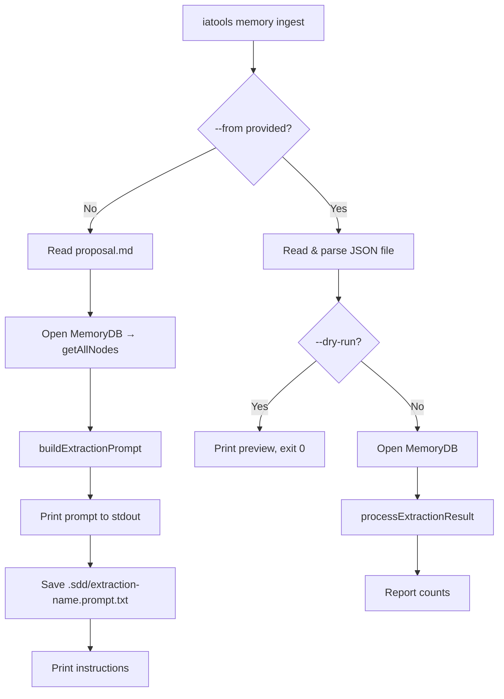

# Design: memory-ingest

## Overview

Minimal, focused addition: one new file (`src/commands/memory-ingest.ts`), one line in `cli.ts` to register the subcommand, and test coverage. No changes to `ingestion.ts`, `database.ts`, or any other existing module.

---

## Architecture

The command operates in two mutually-exclusive modes, derived from whether `--from` is present:

```
iatools memory ingest --change <name>
  │
  ├─ No --from → Prompt Generation Mode
  │     ├─ fs.pathExists(openspec/changes/<name>/proposal.md)  → error if missing
  │     ├─ fs.pathExists(.sdd/memory.db)                       → error if missing
  │     ├─ db = new MemoryDB(dbPath)
  │     ├─ existingNodes = db.getAllNodes()
  │     ├─ db.close()
  │     ├─ prompt = buildExtractionPrompt(proposalContent, existingNodes)
  │     ├─ print prompt to stdout
  │     ├─ fs.writeFile(.sdd/extraction-<name>.prompt.txt, prompt)
  │     └─ print usage instructions
  │
  └─ --from <path> → JSON Ingestion Mode
        ├─ fs.pathExists(.sdd/memory.db)                       → error if missing
        ├─ fs.readFile(<path>)                                  → error if invalid JSON
        ├─ validate shape: { nodes: [], edges: [] }             → error if invalid
        ├─ if --dry-run:
        │     └─ print what would be inserted, exit 0
        └─ db = new MemoryDB(dbPath)
              processExtractionResult(db, rawResult, changeName)
              db.close()
              print summary
```

---

## File Changes

### New: `src/commands/memory-ingest.ts`

Single exported function `runMemoryIngest(options)`:

```typescript
interface MemoryIngestOptions {
  change: string;
  dir: string;
  from?: string;
  dryRun: boolean;
}
```

**Prompt Generation Mode** (no `--from`):
1. Resolve `openspec/changes/<change>/proposal.md` from `dir` — fail fast if missing
2. Resolve `.sdd/memory.db` from `dir` — fail fast if missing
3. Open `MemoryDB`, call `getAllNodes()`, close DB
4. Call `buildExtractionPrompt(content, nodes)`
5. Print separator + prompt to stdout
6. `fs.writeFile(path.join(dir, '.sdd', `extraction-${change}.prompt.txt`), prompt)`
7. Print next-step instructions

**JSON Ingestion Mode** (`--from` present):
1. Resolve `.sdd/memory.db` — fail fast if missing
2. Read and JSON-parse the file — fail fast on malformed JSON
3. Validate `result.nodes` is an array and `result.edges` is an array
4. If `--dry-run`: print what would be inserted (titles, labels, edges), exit 0
5. Open `MemoryDB`, call `processExtractionResult(db, result, change)`, close DB
6. Spinner → succeed with count summary

### Modified: `src/cli.ts`

Add one registration line under the existing `memoryCmd`:

```typescript
import { runMemoryIngest } from '@/commands/memory-ingest';

memoryCmd
  .command('ingest')
  .description('📥  Ingest an approved proposal into the memory graph')
  .requiredOption('--change <name>', 'change name (matches openspec/changes/<name>/)')
  .option('--dir <path>', 'target project directory', process.cwd())
  .option('--from <path>', 'path to LLM extraction JSON file')
  .option('--dry-run', 'validate and preview without writing to DB', false)
  .action(async (options) => {
    await runMemoryIngest({
      change: options.change,
      dir: path.resolve(options.dir),
      from: options.from,
      dryRun: options.dryRun,
    });
  });
```

### Modified: `test/unit/iatools.test.ts`

Add a new `describe('memory ingest')` block covering:
- Prompt generation: reads proposal, calls `buildExtractionPrompt`, writes prompt file
- JSON ingestion: parses JSON, calls `processExtractionResult`, reports counts
- Dry-run: does not call `processExtractionResult`
- Missing proposal error path
- Missing database error path
- Invalid JSON error path

---

## Data Flow Diagram



---

## External Dependencies

None new. Uses:
- `fs-extra` — already in `package.json`
- `ora` — already in `package.json`
- `@/memory/database` — existing module
- `@/memory/ingestion` — existing module
- `@/utils/logger` — existing module

---

## Error Handling Strategy

All errors are handled with `logger.error(message)` + `process.exit(1)` to keep the command scriptable. No uncaught exceptions should surface to the user.

---

## Risk Assessment

| Risk | Likelihood | Mitigation |
|---|---|---|
| `getAllNodes()` returns large set, prompt too big | Low | `buildExtractionPrompt` already formats concisely; this is an LLM concern |
| `processExtractionResult` throws on edge FK violation | Medium (expected) | Already handled inside the function via DB constraint + validation |
| `--from` file path is relative vs absolute | Low | `path.resolve(options.dir, options.from)` normalizes it |
| `--dry-run` used without `--from` | N/A | Guard: print warning and switch to prompt-generation mode |
